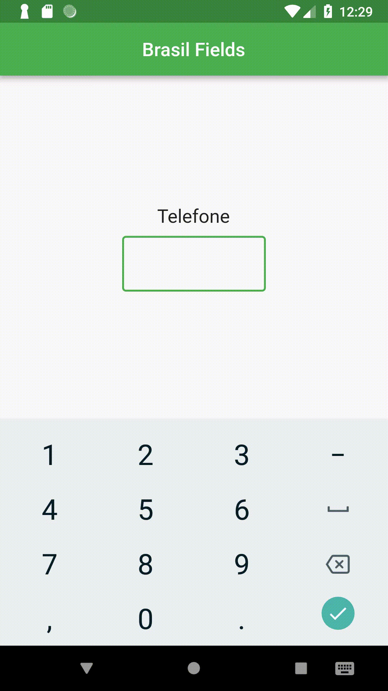

# brasil_fields

O jeito mais fácil de utilizar padrões e formatos brasileiros em seu projeto.

## Apresentação

Este package facilita o desenvolvimento com a linguagem Dart em projetos que 
utilizam campos com os padrões e formatos brasileiros.

### Formatters 

* CPF 
  </img>
* CNPJ 
  </img>
* CEP  
  </img>
* Real (R$)
  </img>
* Telefones (fixo e celular)
  </img>

### Padrões 
- Estados  
- Meses
- Regiões
- Semana

#### TO-DO
- Validações com RegExp
- Exemplos
- Screenshots/GIFs
